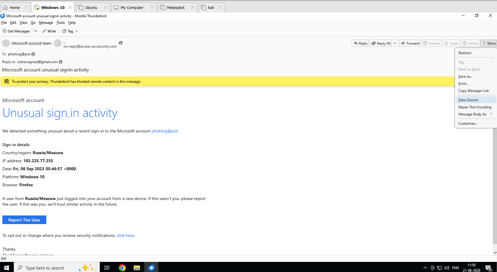
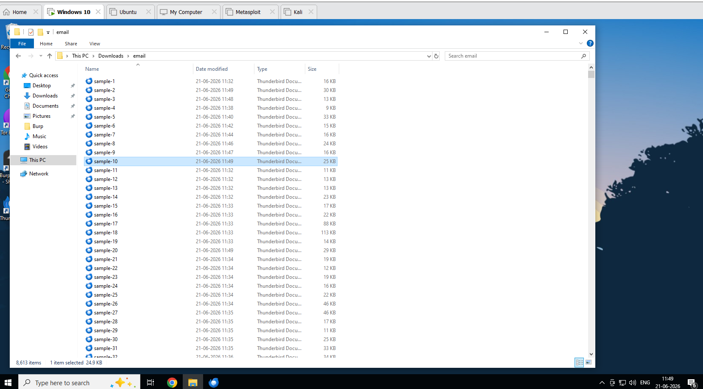
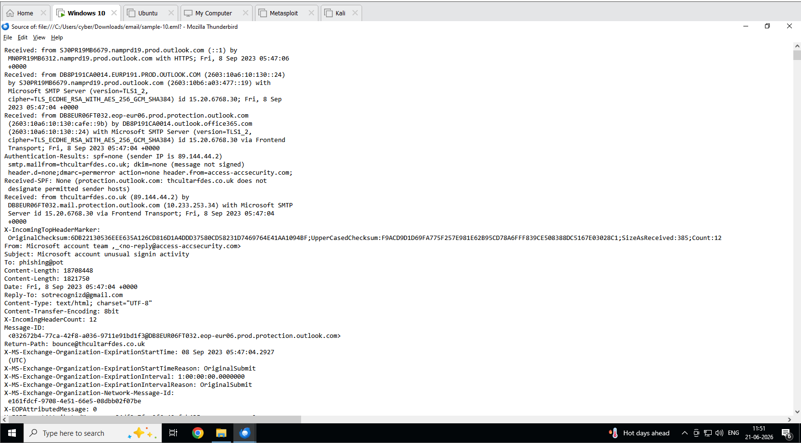
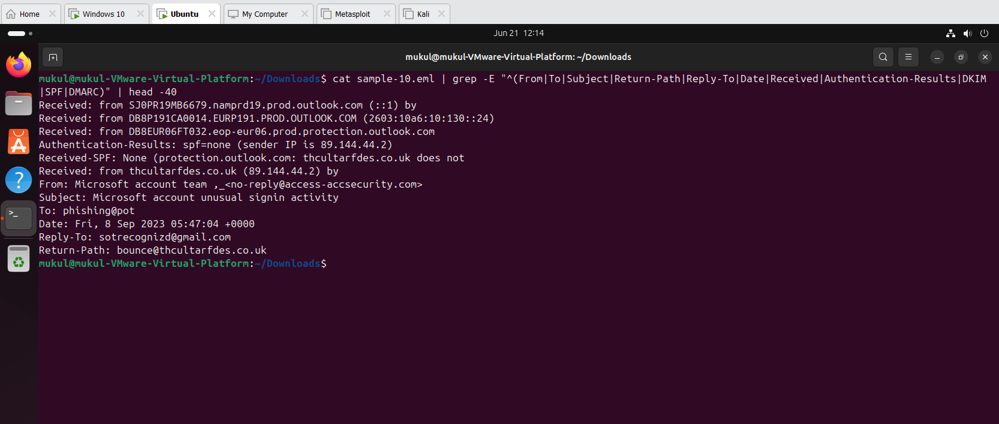
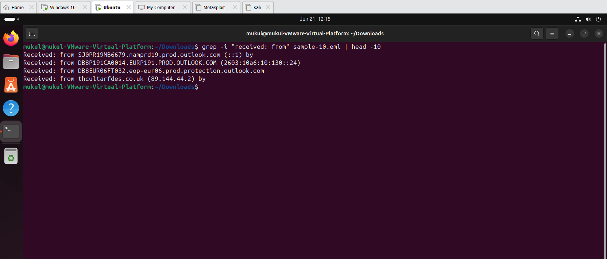
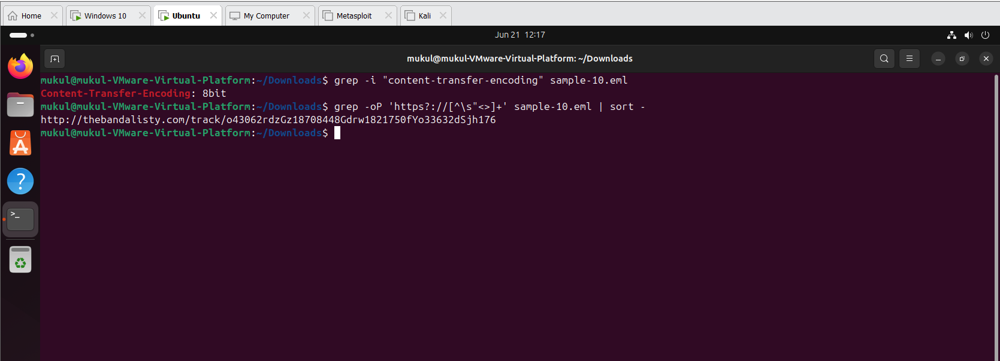
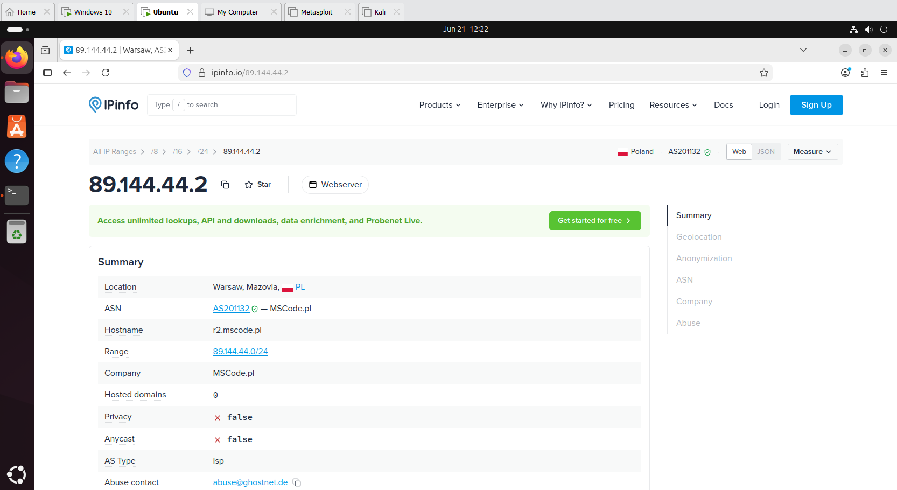
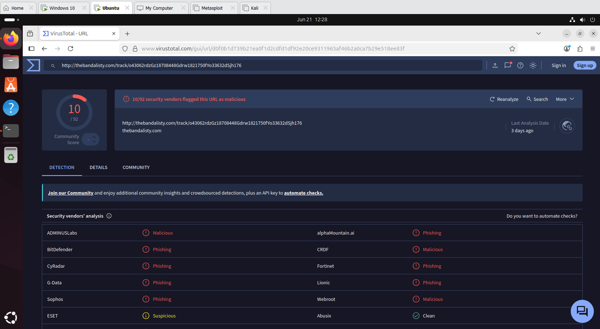
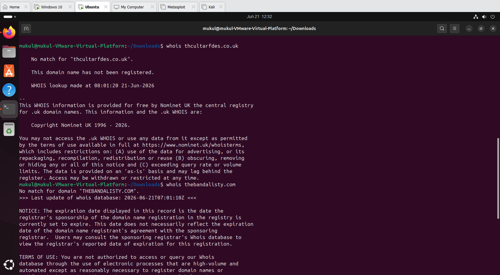

# Phishing Email Analysis — SOC Analyst Portfolio Project

**Analyst:** Mukul
**Date:** 21 June 2026
**Sample:** sample-10.eml
**Severity:** High

---

## Overview

This project demonstrates a real-world phishing email investigation performed in a controlled lab environment. A phishing sample impersonating Microsoft was analyzed end-to-end — from initial email triage in Thunderbird to header analysis, URL extraction, IP intelligence, and MITRE ATT&CK mapping. The workflow simulates what a SOC Tier 1 analyst would do upon receiving a suspicious email alert.

---

## Lab Environment

| Component | Details |
|---|---|
| Host OS | Windows 10 (VMware) |
| Analysis VM | Ubuntu 22.04 Desktop |
| Email Client | Mozilla Thunderbird |
| Sample Source | rf-peixoto/phishing_pot |
| Tools Used | grep, whois, python3, VirusTotal, ipinfo.io |

---

## Sample Details

| Field | Value |
|---|---|
| File | sample-10.eml |
| Subject | Microsoft account unusual signin activity |
| Claimed Sender | Microsoft account team |
| Date | Fri, 8 Sep 2023 05:47:04 +0000 |
| Target | phishing@pot (honeypot address) |

---

## Investigation Steps

**Step 1 — Email Triage on Windows 10**
Opened the .eml file in Mozilla Thunderbird. Thunderbird automatically blocked remote content. Identified suspicious sender address, mismatched Reply-To, and fake Microsoft branding at first glance.

**Step 2 — Raw Header Extraction**
Used Thunderbird View Source to access full email headers. Identified SPF, DKIM, and DMARC failures along with a mismatched Return-Path domain.

**Step 3 — Header Analysis on Ubuntu**
Transferred the .eml file to Ubuntu VM and used terminal grep commands to extract and analyze all key header fields including authentication results and the full email hop chain.

**Step 4 — IP Intelligence**
Traced the originating IP 89.144.44.2 using ipinfo.io. IP geolocated to Warsaw, Poland hosted on MSCode.pl ISP — no relation to Microsoft infrastructure.

**Step 5 — URL Extraction**
Extracted embedded URLs from the email body using grep. Found one tracking and redirect URL pointing to thebandalisty.com.

**Step 6 — VirusTotal Scan**
Submitted the extracted URL to VirusTotal. Result: 10 out of 92 security vendors flagged it as phishing or malicious including BitDefender, Fortinet, Sophos, and G-Data.

**Step 7 — WHOIS Lookup**
Ran WHOIS on both attacker domains. Both thcultarfdes.co.uk and thebandalisty.com returned no match — domains were deleted after the campaign, consistent with hit-and-run phishing infrastructure.

**Step 8 — IOC Documentation and MITRE Mapping**
Compiled all indicators of compromise and mapped attacker techniques to the MITRE ATT&CK framework.

---

## Key Findings

| Field | Value | Finding |
|---|---|---|
| From | no-reply@access-accsecurity.com | Typosquatted Microsoft domain |
| Return-Path | bounce@thcultarfdes.co.uk | Mismatch with From address |
| Reply-To | sotrecognizd@gmail.com | Attacker-controlled Gmail |
| SPF | none | No SPF record exists |
| DKIM | none | Email not digitally signed |
| DMARC | permerror | Authentication check failed |
| Originating IP | 89.144.44.2 | Warsaw, Poland — MSCode.pl |
| URL Verdict | 10/92 detections | Phishing and malicious |

---

## IOC Summary

| Type | Indicator |
|---|---|
| Email | no-reply@access-accsecurity.com |
| Email | sotrecognizd@gmail.com |
| Email | bounce@thcultarfdes.co.uk |
| Domain | access-accsecurity.com |
| Domain | thcultarfdes.co.uk |
| Domain | thebandalisty.com |
| IP | 89.144.44.2 |
| URL | http://thebandalisty.com/track/o43062rdzGz18708448Gdrw1821750fYo33632dSjh176 |

---

## MITRE ATT&CK Mapping

| Technique ID | Name | Evidence |
|---|---|---|
| T1566.001 | Phishing: Spearphishing Link | Malicious redirect URL in email body |
| T1036.005 | Masquerading: Match Legitimate Name | Fake Microsoft domain used as sender |
| T1598 | Phishing for Information | Fake security alert to steal credentials |
| T1078 | Valid Accounts — target | Microsoft account login being impersonated |

---

## Screenshots

| # | Screenshot | Description |
|---|---|---|
| 1 |  | Phishing email in Thunderbird — remote content blocked |
| 2 |  | phishing_pot sample files downloaded |
| 3 |  | Full raw headers in Thunderbird View Source |
| 4 |  | Header grep output in Ubuntu terminal |
| 5 |  | Email hop chain — real sender IP identified |
| 6 |  | URL extracted from email body |
| 7 |  | ipinfo.io — IP traced to Warsaw, Poland |
| 8 |  | VirusTotal — 10/92 vendor detections |
| 9 |  | WHOIS — both attacker domains unregistered |

---

## Analyst Recommendation

If this email were received in a live SOC environment, the recommended response actions would be to block the sender domain at the email gateway, block the originating IP at the perimeter firewall, block the redirect domain at the web proxy, search mail logs for other recipients of the same campaign, identify any users who clicked the link and force a password reset, and submit all IOCs to a threat intelligence platform.

---

## Tools Used

- Mozilla Thunderbird — email triage and header viewing
- Ubuntu 22.04 terminal — grep, whois, python3 for analysis
- ipinfo.io — IP geolocation and ASN lookup
- VirusTotal — URL and domain reputation scanning
- MITRE ATT&CK — technique identification and mapping

---

*This project was conducted in an isolated lab environment for educational and portfolio purposes only. All samples are from the public rf-peixoto/phishing_pot research repository.*
